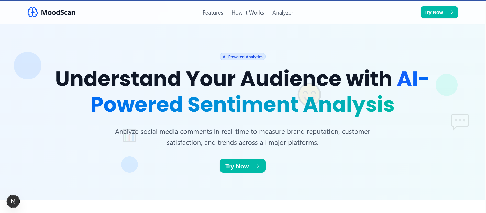
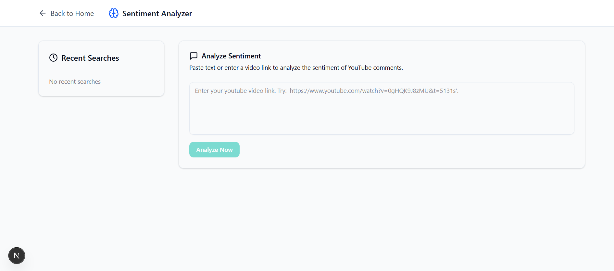

# YouTube Sentiment Analyzer 🎭📊

Alat bertenaga AI untuk menganalisis sentimen dan mengekstrak wawasan dari komentar YouTube dalam berbagai bahasa — termasuk bahasa gaul Indonesia seperti *"Mantul"* atau *"Gaje"*.

[](https://your-demo.vercel.app)
[](https://nextjs.org)
[](https://replicate.com/ibm/granite-3b-instruct)




---

## ✨ Fitur

- ✅ **Analisis Sentimen Multibahasa**
  Memahami komentar dalam bahasa Indonesia (dengan dukungan bahasa gaul), bahasa Inggris, atau campuran.

- ✅ **Klasifikasi Sentimen Otomatis**
  Kategorikan komentar sebagai **Positif**, **Netral**, atau **Negatif**.

- ✅ **Ekstraksi Kata Kunci**  
  Identifikasi frasa dominan seperti _“kemasan rusak”_ atau _“pengiriman cepat”_.

- ✅ **Riwayat Analisis**
  Simpan riwayat analisis melalui Session Storage.

---

## 🧠 Cara Kerjanya

### 1. Klasifikasi Sentimen

| Label      | Contoh Komentar                            |
|------------|---------------------------------------------|
| ✅ Positive | "Keren banget!", "Gaskeun", 😊❤️            |
| 🟢 Neutral  | "Saya beli di Shopee", "Bagus sih..."       |
| ❌ Negative | "Gak worth it", "Ripuh", 😠👎                |

### 2. Pengenalan Bahasa Gaul & Emoji

Mendukung istilah informal/gaul dan pemetaan sentimen emoji.

### 3. Format Output (Contoh)

```json
{
  "positive": 65,
  "neutral": 20,
  "negative": 15,
  "keywords": {
    "positive": ["bagus", "menarik"],
    "negative": ["bosan", "suara kecil"]
  },
  "rawComments": [
    { "text": "Kontennya bagus!", "sentiment": "positive" },
    { "text": "Pembawaan video nya menarik", "sentiment": "negative" }
  ]
}
```

---

## 🚀 Cara Menggunakan

### 1.Menganalisis Komentar Video YouTube
- Tempel URL video YouTube (misalnya, `https://www.youtube.com/watch?v=xyz123dsf`)
- Click **"Analisis Sekarang"**
- Lihat:
  - Persentase sentimen
  - Wawasan kata kunci
  - Sample rincian komentar mentah


---

## 🛠️ Tech Stack

| Komponen     | Teknologi         | Kelebihan                            |
|--------------|-------------------|-----------------------------------|
| Frontend & Backend     | Next.js 14        | SEO-friendly & fast rendering     |
| Styling      | Tailwind CSS      | Mudah, cepat dan Konsistensi Desain              |
| AI Model     | IBM Granite 3.3B-instruct  | Kemampuan Pemahaman Bahasa yang Luas        |
| Deployment   | Vercel            | Deploy Otomatis & Instan             |


---

## ⚙️ Panduan Instalasi

### Prasyarat
- Node.js 18+
- YouTube Data API v3 Key
- Replicate API Key

### Langkah-langkah

```bash
# Clone the repo
git clone https://github.com/Araihan413/Sosmed-Sentiment-Analyzer.git
cd Sosmed-Sentiment-Analyzer

# Install dependencies
npm install

# Create .env.local file
touch .env.local
```

Di dalam `.env.local`, tambahkan:

```env
YOUTUBE_API_KEY=your_youtube_api_key
REPLICATE_API_KEY=your_replicate_api_key
```

Kemudian mulai server development:

```bash
npm run dev
```

Kunjungi `http://localhost:3000` di browser Anda.

---

## 📊 Contoh Kasus Nyata

**Kasus**: Seorang YouTuber memposting ulasan gadget dan menerima lebih dari 500 komentar.
**Masalah**: Mereka tidak menyadari banyak penonton mengeluh tentang **daya tahan baterai**.  
**Solusi**:
- Analisis video dengan alat ini
- Temukan bahwa 25% komentar menyebutkan **“baterai cepat habis”**
- Atasi masalah ini di konten mendatang

---

## 📜 License

MIT © 2025 Ahmad Raihan

---

## 🎯 Fitur Berikutnya (Direncanakan)

- 📈 Bandingkan sentimen di beberapa video
- 🔔 Beri peringatan saat sentimen negatif meningkat
- 📂 Peningkatan ekspor CSV/PDF

---

> 💡 Hemat waktu dan buat keputusan yang lebih cerdas dengan memahami suara audiens Anda — powered by AI.
